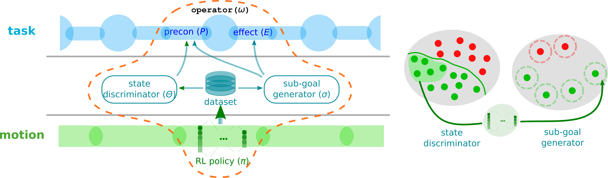

# ORL-TAMP

Optimistic Reinforcement Learning Task and Motion Planning (ORL-TAMP) is a framework integrating an RL policy into TAMP pipelines. The general idea is to encapsulate an RL policy into a so-called _skill_. A skill comprises an RL policy, a state discriminator, and a sub-goal generator. Besides steering the action, the RL policy, state discriminator, and sub-goal generator are used to verify symbolic predicates and ground geometric values.


<!-- &emsp; -->

## Video
The method introduction and experiments:

[](https://youtu.be/mlLTIFM01ig)

## Installation 
   
   The current version is tested on Ubuntu 20.04
   
   1. Dependencies:
   
      * [MoveIt](https://moveit.ros.org/) (ROS Noetic)

      * [Stable-Baselines3](https://github.com/DLR-RM/stable-baselines3/tree/master)

      We are currently trying to remove the dependency of MoveIt due to its inflexibility and ROS specificity.

   2. Build PDDL FastDownward solver:
      ```
      orl_tamp$ ./downward/build.py
      ```

   3. Compile IK solver:
      ```
      orl_tamp$ cd utils/pybullet_tools/ikfast/franka_panda/
      franka_panda$ python setup.py
      ```


## Run
   
   1. Download the RL policy models: [Retrieve](https://drive.google.com/file/d/1UGd9uoGRnoQsUGBsJQmJ6i1QxkTuBz9B/view?usp=drive_link) and [EdgePush](https://drive.google.com/file/d/1tdIOrf1GFvP4PCmKRepSF5rJe3CE-rUU/view?usp=drive_link), and save policies in the `/orl_tamp/policies` folder. 

   2. Run MoveIt (following the [tutorial](https://ros-planning.github.io/moveit_tutorials/))

   3. Run demos:
      * Retrieve: `orl_tamp$ ./run_demo.sh retrieve`
      * EdgePush: `orl_tamp$ ./run_demo.sh edgepush`
      * Rearange: `orl_tamp$ ./run_demo.sh rearrange`

     

## Train 
   
   This section we give general steps about to train your own skills. 
   1. Modify the PDDL domain file and and stream file, add the PDDL definations of the skills.
   2. Use [StableBaselines3](https://stable-baselines3.readthedocs.io/en/master/) to standardized the policy trainning. 
   3. Generate dataset in the domain scenario.  
   4. Train the state discriminator.